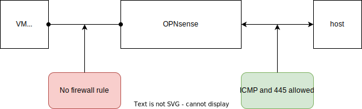
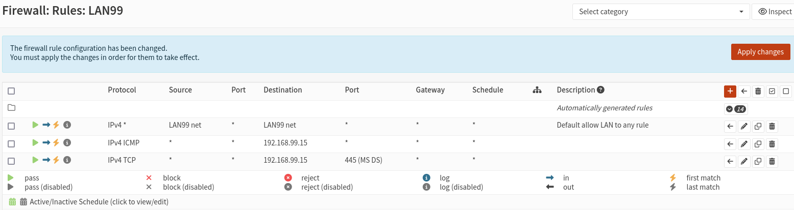

# File Sharing and Host Services

In this section, we’ll create a Samba file server using Docker and expose it to virtual machines via the OPNsense-managed `br-mgmt` network. This pattern can be reused to expose other host-based services (media servers, DNS, reverse proxies, etc.) to segmented VMs.

Docker containers do not have direct access to `br-mgmt`. Instead of bridging containers directly, we expose the container’s service port on the host and let OPNsense route traffic to the host at `192.168.99.15`. From the VM’s perspective, the host acts like a standard LAN server.

## Setup with Docker Compose

We’ll use `docker-compose` to manage the Samba container, bind a local disk, and create a small, dedicated Docker network.

Create a directory for shared services:

```bash
mkdir ~/kvm-shared-services
cd ~/kvm-shared-services
```

Then create a `docker-compose.yaml` file with the following content:

```yaml
services:
  samba:
    image: dockurr/samba
    container_name: kvm-shared-samba
    environment:
      NAME: Data
      USER: user
      PASS: password
    ports:
      - 445:445
    volumes:
      - /mnt/data/shared:/storage
    restart: always
    networks:
      - kvm-shared-network

networks:
  kvm-shared-network:
    name: kvm-shared-network
    ipam:
      config:
        - subnet: 172.19.1.192/28
          gateway: 172.19.1.193
```

## Launch the Service

Inside the same folder, start the container in the foreground to observe startup logs:

```bash
docker compose up
```

Once the container starts successfully and no errors appear, stop it with `Ctrl+C` and run it again in detached mode:

```bash
docker compose up -d
```

## First OPNsense GUI Access

At this point, the Samba service is reachable at `192.168.99.15:445`, but OPNsense blocks traffic by default. To allow access from VMs, we need to create a firewall rule on the `br-mgmt` network (`192.168.99.0/24`).

Before that, we’ll access OPNsense’s web interface for the first time. In a browser on the host, open:

```
http://192.168.99.1/
```

Log in using the root user and the password you set during installation.

Before creating the rule, enable SSH access. This makes future changes easier from the host terminal. Navigate to:

```
System > Settings > Administration
```

Enable:

* **Enable Secure Shell**
* **Permit root user login**
* **Permit password login**

Click **Apply**. Now you can connect to the firewall using:

```bash
ssh root@192.168.99.1
```

To keep naming consistent with your segmented LAN design, we will rename the default interface from `LAN` to `LAN99`. In the web interface, go to:

```
System > Interfaces > Assignments
```

Click on `LAN`. On the configuration page, change the **Description** field to `LAN99`. Click **Save**, then **Apply Changes**.

In the next step, we’ll create the firewall rule that allows VM access to the Samba share on the host.

## Setting LAN99 Firewall Rules

By default, OPNsense creates a rule that allows all traffic from the `LAN99` network to anywhere. This simplifies initial access to the web interface but is too permissive for our setup.

We won’t delete this rule — doing so would immediately drop our current access. Instead, we’ll **edit** it to restrict traffic from `LAN99` only to `LAN99`. We’ll also remove the unused IPv6 rule and add two explicit rules: one to allow ping and another to allow Samba (TCP 445) access to the host.

This allows VM access to host services **only from LAN99**. For other networks like `LAN20`, matching rules will be required there as well.



Now, go to:

```
Firewall > Rules > LAN99
```

* **Edit the default IPv4 rule**: Click the pencil icon. Change **Destination** from `any` to `LAN99 net`. In the listbox, uncheck `any`, then check `LAN99 net`. Click **Save**.

* **Delete the IPv6 rule**.

* **Add ICMP rule**: Click the red **+** icon. Set `Action: pass`, `Protocol: ICMP`, `Source: any`, `Destination: 192.168.99.15`, `Description: Allow ping to host`. For IP input, choose `Single host or Network`, then enter the IP below. Click **Save**.

* **Add Samba rule**: Add another rule. Set `Action: pass`, `Protocol: TCP`, `Source: any`, `Destination: 192.168.99.15`, `Port range: 445 to 445`, `Description: Allow Samba to host`. For custom port input, choose `other`, then enter `445`. Click **Save**.

**If you're unsure how to correctly select `LAN99 net`, define a single IP, or set custom port ranges, refer to the [Troubleshooting](./troubleshooting.md) section.**

You should now see something like this:



Review the rules, then click **Apply changes** to activate them.

