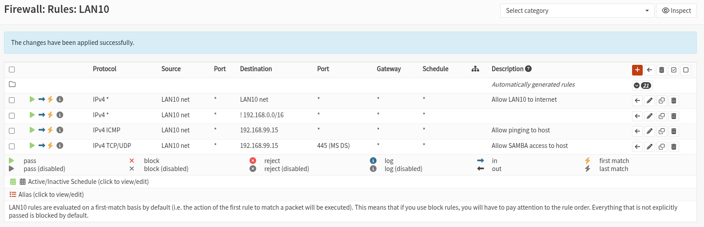

# LAN10: Direct Internet Access

LAN10 is the simplest and most transparent of the segmented networks — its goal is to provide **direct, unencrypted internet access** to virtual machines without routing traffic through a VPN. This setup is ideal for use cases that prioritize performance or don't require traffic obfuscation, such as gaming, media streaming, or general workloads where privacy isn't critical.

In this setup, we’ll assign **vtnet2** to a new interface named `LAN10` in OPNsense. Then we’ll configure a **DHCP server** for that network, reserving the lower IP range for **static assignments** and leaving the higher range for **dynamic allocation**. This approach ensures that important VMs retain consistent IPs across reboots while still allowing flexibility for ad-hoc deployments. We will also set DNS servers for this network to **8.8.8.8,1.1.1.1** (in other networks, DNS servers will be those provided by the VPN provider).

For internet access, LAN10 traffic will be **NATed through the WAN interface of OPNsense**, which connects to your home router via `br0`. Importantly, this **does not reuse the host’s IP address** — instead, OPNsense obtains its own unique IP from the router (e.g., `192.168.0.16`) and handles routing independently of the host (which might have an IP like `192.168.0.15`).

Lastly, we’ll define **firewall rules** that allow all outbound traffic, permit access to host services (such as Samba), and enable ICMP (ping) for diagnostics.

Once complete, any VM attached to the `virbr-lan10` virtual switch will receive an IP address from OPNsense and gain unrestricted internet access, along with controlled access to host-based services.

## Assigning the Interface

Navigate to `Interfaces - Assignments` and add a new assignment selecting `vtnet2` from the dropdown and adding `LAN10` as description. Next, click on the newly created interface `LAN10`, check **Enable Interface**, select **Static IPv4** as `IPv4 Configuration Type`, set the `IPv4 address` to **192.168.10.1/24**, click `Save`, and then `Apply changes`.

## DHCP Server

Navigate to `Services - Dnsmasq DNS & DHCP - General` and in the `Interface` listbox select the networks that will use this service. At this point we should remove **LAN99** from the list and add **LAN10**. Leave the rest of the fields unchanged and click `Apply`.

Then go to `Services - Dnsmasq DNS & DHCP - DHCP ranges`, click the red plus icon, select **LAN10** as interface, set **192.168.10.200** as start address and **192.168.10.240** as end address, set `Subnet mask: 255.255.255.0` , write `LAN10 DHCP` as description, and click `Save` and then `Apply`.

**Important**: I strongly recommend setting the subnet mask explicitly to 255.255.255.0 in the DHCP range. Leaving it as “automatic” may cause OPNsense to assign 255.255.0.0 instead — something I personally observed in a setup where the configuration wasn’t fully defined. The system worked perfectly at first, but after unrelated changes (like editing a firewall rule or reassigning interfaces), OPNsense began handing out the broader mask, which silently broke inter-segment routing. I’m not exactly sure what triggered the change, but removing that ambiguity restored stability.

Finally, go to `Services - Dnsmasq DNS & DHCP - DHCP options`, click the red plus icon, and set: `Type: set`, `Option: dns-server [6]`, `Option6: None`, `Interface: LAN10`, `Tag: Nothing selected`, `Value: 8.8.8.8,1.1.1.1`, `Force: unchecked`, `Description: LAN10 DNS = 8.8.8.8,1.1.1.1`, then click `Save` and `Apply`.

## Firewall Rules

Navigate to `Firewall - Rules - LAN10` and add next rules:

- `Action: Pass`, `Interface: Lan10`, `Source: LAN10 net`, `Destination: LAN10 net`, `Description: Allow local access to LAN10 network`.
- `Action: Pass`, `Interface: Lan10`, `Source: LAN10 net`, `Destination: !192.168.0.0/16`, `Description: Allow direct internet access in LAN10 `. **Destination !192.168.0.0/16 is obtained by checking the upper checkbox that says "Use this option to invert the sense of the match." and selecting Single host or network and setting the ip address with network size.**
- `Action: Pass`, `Interface: Lan10`, `Source: LAN10 net`, `Protocol: ICMP` `Destination: 192.168.99.15/32`, `Description: Allow pinging to host`.
- `Action: Pass`, `Interface: Lan10`, `Source: LAN10 net`, `Protocol: TCP/UDP` `Destination: 192.168.99.15/32`, `Destination port range: 445 to 445`, `Description: Allow SAMBA access to host`.

Once four rules are created click on `Apply changes`.

You should be seeing something similar to next picture:




## Test the System

To test the configuration, create a VM and verify that:

* It receives a valid IP in the `192.168.10.0/24` range
* It can reach the internet
* It can ping the OPNsense LAN10 gateway and the host
* It can access the Samba service at `192.168.99.15`

In my case, I created a Ubuntu Desktop VM, attached it to the correct virtual network (`switch-lan10`), and powered it on.

Once the system is running, open a terminal and run:

```bash
ip address
ping 192.168.10.1
ping 8.8.8.8
ping 192.168.99.15
```

### Expected results:

* `ip address` should show an assigned IP in the `192.168.10.200–240` range
* `ping 192.168.10.1` should succeed — confirms LAN10 gateway (OPNsense) is reachable
* `ping 8.8.8.8` should succeed — confirms internet access through NAT
* `ping 192.168.99.15` **should** work — but **it won’t yet**, even if everything above is correct

This last failure is expected — and it’s not your fault. It’s caused by how Linux handles routing from the host. The explanation is fully documented in [host access to isolated lans](./host-access-to-isolated-lans.md), but if you're impatient to fix it, just run this on the host:

```bash
sudo nmcli connection modify br-mgmt +ipv4.routes "192.168.10.0/24 192.168.99.1"
sudo nmcli connection reload
sudo nmcli device reapply br-mgmt
```

This tells the host: “to reach LAN10, go through the OPNsense management interface at `192.168.99.1`.”

Run the ping again — now it will hopefully work.

If this breaks access of the host to `opnsense VM`, the likely issue is that `opnsense VM` gets detached from the network when doing this operation. To reattach it you will need to switch off `opnsense VM` and power it on again. Restarting will not work.
