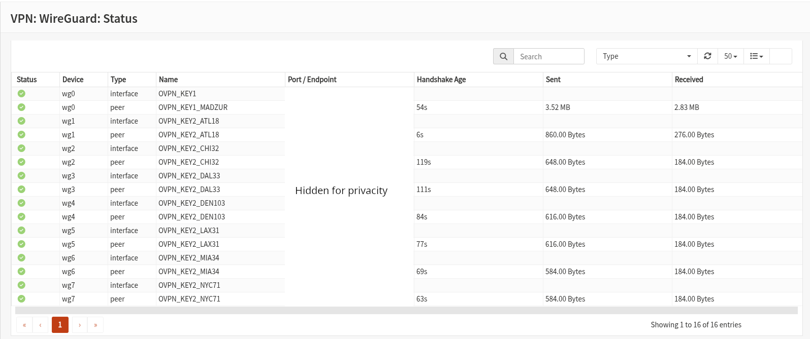

# LAN30: VPN with switchable IPs using WireGuard Pools

LAN30 builds on the VPN architecture introduced in LAN20 by enabling **manual switching between multiple WireGuard VPN endpoints** within the same network segment. Rather than using a fixed VPN server, LAN30 allows you to route traffic through different exit nodes on demand — ideal for **testing scenarios where the public IP address needs to change**, **moving services across regions**, or achieving **basic anonymity** by periodically rotating VPN connections.

This segment is designed for situations where the same VM might need to appear as if it's operating from different locations — such as rotating through VPN servers in Sweden, Germany, or the US — without changing the VM’s internal configuration. Use cases include:

* Testing services that must switch between geographic regions
* Deploying a server that periodically changes IP addresses for anonymity
* Simulating user behavior from different countries
* Avoiding long-term IP fingerprinting during web access or scraping tasks
* Testing p2p systems where we can have 2 VMs shown as participants of different regions in this network acting as clients, and the server implemented in a container in the host that sends other parties connection info after both clients have connected to the server.

Although we could configure our system with a **single WireGuard instance** and **multiple peer definitions**, in order to create a gateway per peer, we need to create one instance per peer.

As with other segments, LAN30 includes **DHCP, custom DNS options, and firewall rules** that isolate it from other LANs while allowing controlled access to host-based services such as Samba. Static routes on the host ensure reliable return paths for services initiated from LAN30.

LAN30 is intentionally simple but powerful: it doesn’t require scripts or automation, yet provides a flexible platform for **location shifting, controlled identity rotation, and real-world anonymity workflows**.

## Assigning the Interface

Navigate to `Interfaces - Assignments` and add a new assignment selecting `vtnet4` from the dropdown and adding `LAN30` as description. Next, click on the newly created interface `LAN30`, check **Enable Interface**, select **Static IPv4** as `IPv4 Configuration Type`, set the `IPv4 address` to **192.168.30.1/24**, click `Save`, and then `Apply changes`.

## DHCP Server

Navigate to `Services - Dnsmasq DNS & DHCP - General` and in the `Interface` listbox select the networks that will use this service. Add **LAN30**. Leave the rest of the fields unchanged and click `Apply`.

Then go to `Services - Dnsmasq DNS & DHCP - DHCP ranges`, click the red plus icon, select **LAN30** as interface, set **192.168.30.200** as start address and **192.168.30.240** as end address, set `Subnet mask: 255.255.255.0`, write `LAN30 DHCP` as description, and click `Save` and then `Apply`.

Go also to `Services - Dnsmasq DNS & DHCP - DHCP options`, click the red plus icon, and set: `Type: set`, `Option: dns-server [6]`, `Option6: None`, `Interface: LAN30`, `Tag: Nothing selected`, `Value: [your VPN provider DNS servers, comma-separated] (e.g., 1.1.1.1,1.2.3.4)`, `Force: unchecked`, `Description: LAN30 DNS = VPN Provider`, then click `Save` and `Apply`.

## Peer Configuration Table (for `OVPN_KEY2`)

Each row represents a different **exit node** (VPN server) with its own dedicated WireGuard instance, allowing us to assign **a unique gateway per endpoint**.

| Peer Name      | Public Key     | Endpoint                   | Description        |
| -------------- | -------------- | -------------------------- | ------------------ |
| `OVPN_KEY2_DE` | `<public_key>` | `de.vpn.example.com:51820` | Germany VPN server |
| `OVPN_KEY2_US` | `<public_key>` | `us.vpn.example.com:51820` | US VPN server      |
| `OVPN_KEY2_SE` | `<public_key>` | `se.vpn.example.com:51820` | Sweden VPN server  |

* Each peer is defined with its own **WireGuard instance**
* Tunnel IP and DNS are set per instance
* Each peer will be configured with:

  * Public Key
  * Endpoint (host\:port)
  * Allowed IPs: `0.0.0.0/0`
  * Keepalive: `25`

You should fill a similar table with your own data and prepare the matching instance and peer configurations as described below.

## WireGuard Configuration

In this section, we’ll create one WireGuard instance **per peer**, each with its own tunnel IP and credentials. This enables clean gateway definitions and allows switching egress paths by simply updating the `Gateway` field in a firewall rule.

### Instance Configuration

Navigate to `VPN - WireGuard - Instances` and for each peer in your table do the following: click the **+** button to create a new WireGuard instance, set the `Name` to the peer name (e.g., `OVPN_KEY2_DE`), paste your private key into the `Private Key` field, and enter the matching public key. Set the `DNS Servers` field to match the values provided by your VPN provider (e.g., `10.0.0.1`) - you will need to enable **Advanced Mode** (upper right toggle in the WireGuard UI) to see this field. Make sure to check the box labeled **Disable Routes**, which ensures that we will control all routing manually later on. Leave the other fields at their default values, then click `Save`. Repeat this process for each VPN server you want to use, creating one instance per peer.

### Peer Configuration

Now navigate to `VPN - WireGuard - Peers` and click the **+** button to define the peer for each instance. Set the `Name` to the value of the instance name (e.g., `OVPN_KEY2_DE`), use the `Public Key` from the `[Peer]` section of your configuration file, set `Allowed IPs` to `0.0.0.0/0`, and enter the remote VPN server in the `Endpoint` field (e.g., `de.vpn.example.com`). Set the `Endpoint Port` according to your provider (typically `51820`), and choose `25` as the `Keepalive Interval` to keep the connection alive through NAT devices. In the `Instance` dropdown, select the matching instance previously created (e.g., `OVPN_KEY2_DE`). Click `Save`. Repeat this process for each peer, using a one-to-one mapping between instance and peer.

### Enable WireGuard Service

After all peers have been defined, navigate to `VPN - WireGuard`, check that **Enable WireGuard** is checked, and if not, check it and click `Save`. This will start the WireGuard service, allowing handshakes to occur between each defined peer and your system.

### Assign WireGuard Interfaces

Navigate to `Interfaces - Assignments` and for each instance assign the WireGuard tunnel as an OPNsense interface. Select the WireGuard interface (e.g., `wg1`, `wg2`, ...) from the dropdown, click the **+** button, and set the description to the name of the peer (e.g., `OVPN_KEY2_DE`). Click on the newly assigned interface, check **Enable Interface**, set **IPv4 Configuration Type** to `None`, set **IPv6 Configuration Type** to `None`, and click `Save` and `Apply Changes`. Repeat for each WireGuard instance until all tunnels have been assigned and enabled.

### Create Gateways

Navigate to `System - Gateways - Configuration` and click the **+** button to create a static gateway for routing traffic through each VPN tunnel. For each peer, set the `Name` to `peer name + _GW`, select the corresponding WireGuard interface from the `Interface` dropdown. Set the `IP Address` to a value close to the tunnel IP configured in the instance — typically one less. For example, if the instance uses `172.31.61.210`, set the gateway IP to `172.31.61.209`. As you add more gateways, continue reducing (e.g., `172.31.61.208`, `172.31.61.207`, etc.), assigning a unique remote IP to each one. Check **Disable Gateway Monitoring**, and add a description. Click `Save` and `Apply Changes`.

Once the gateways are created, you can navigate to `VPN - WireGuard - Status` to verify that your WireGuard interfaces and all defined peers are active. If everything is working correctly, you should see recent handshake activity and traffic counters for each peer, confirming that the tunnels are up and ready to be used for routing.



## Configure Outbound NAT Rules

Navigate to `Firewall - NAT - Outbound`, click the **+** button to create a manual Outbound NAT rule for LAN30 traffic. For each peer, set the `Interface` to the corresponding WireGuard interface, configure the `Source` as `LAN30 net` to represent the 192.168.30.0/24 network segment, and set the `Destination` to `any` to cover all internet destinations. Set the `Translation target` to the matching tunnel IP address to ensure that LAN30 traffic appears to originate from your VPN tunnel IP rather than your WAN IP address. Add a descriptive comment like "NAT LAN30 through DE tunnel" and click `Save` and `Apply Changes`.

These NAT rules ensure that traffic from LAN30 is properly translated to use the correct VPN tunnel IP address, allowing the traffic to flow correctly through the encrypted VPN connection and receive return traffic from remote servers.

## Firewall Rules

Navigate to `Firewall - Rules - LAN30` and add the following rules:

* `Action: Pass`, `Interface: LAN30`, `Source: LAN30 net`, `Destination: LAN30 net`, `Description: Allow local access in LAN30 network`.
* `Action: Pass`, `Interface: LAN30`, `Source: LAN30 net`, `Destination: !192.168.0.0/16`, `Gateway: <Select one of the previously created gateways>`, `Description: Route LAN30 traffic through VPN tunnel`
* `Action: Pass`, `Interface: LAN30`, `Source: LAN30 net`, `Protocol: ICMP`, `Destination: 192.168.99.15/32`, `Description: Allow pinging to host`.
* `Action: Pass`, `Interface: LAN30`, `Source: LAN30 net`, `Protocol: TCP/UDP`, `Destination: 192.168.99.15/32`, `Destination port range: 445 to 445`, `Description: Allow SAMBA access to host`.

Once all four rules are created, click on `Apply changes`.

## Testing the Configuration

To test the configuration, connect the network interface of the VM that you are using for testing to `switch-lan30` and restart it (in order to load DHCP configurations):

* It receives a valid IP in the `192.168.30.0/24` range
* It can reach the internet
* It can ping the OPNsense LAN30 gateway and the host
* It can access the Samba service at `192.168.99.15`
* Its IP address is different from your router’s internet address

In my case, I created a Ubuntu Desktop VM, attached it to the correct virtual network (`switch-lan30`), and powered it on.

Once the system is running, open a terminal and run:

```bash
ip address
ping 192.168.30.1
ping 8.8.8.8
ping 192.168.99.15
curl ifconfig.me
```

## Switching the Active Peer

Changing the active peer is as easy as updating the second rule defined in **Firewall Rules**. You should make the following test:

* In a VM that is in `LAN30`, execute `curl ifconfig.me`
* Edit the second rule in `Firewall → Rules → LAN30` and change the **Gateway** dropdown to select a different VPN gateway (e.g., `OVPN_KEY2_US_GW`, `OVPN_KEY2_SE_GW`, etc.)
* Execute `curl ifconfig.me` again

The output should now reflect a new public IP corresponding to the selected exit node.

## Pro Tip: Creating a Multi-Region LAN

You can extend this configuration to build a "multi-region" network where different devices on the same LAN route through different geographic locations simultaneously. To do this, first plan your IP ranges and assign static IPs to your VMs within those ranges using the OPNsense DHCP server.

Next, create firewall rules at the top of your list that use these IP ranges as the `Source`. For example, create one rule where the `Source` is set to `192.168.30.20-192.168.30.29` and directs traffic to your `GW_BILBAO` gateway, and a second rule for the `192.168.30.30-192.168.30.39` range pointing to `GW_NYC`. Now, any VM assigned a static IP within one of those ranges will automatically use the correct geographic gateway for all its internet traffic.
