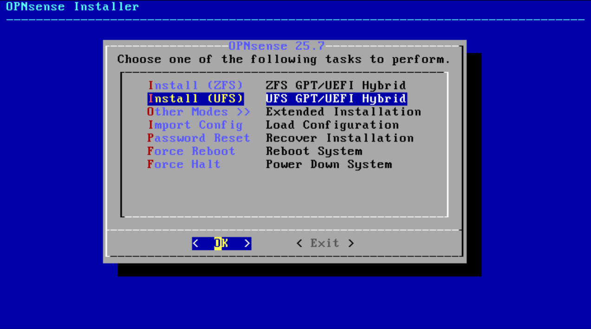
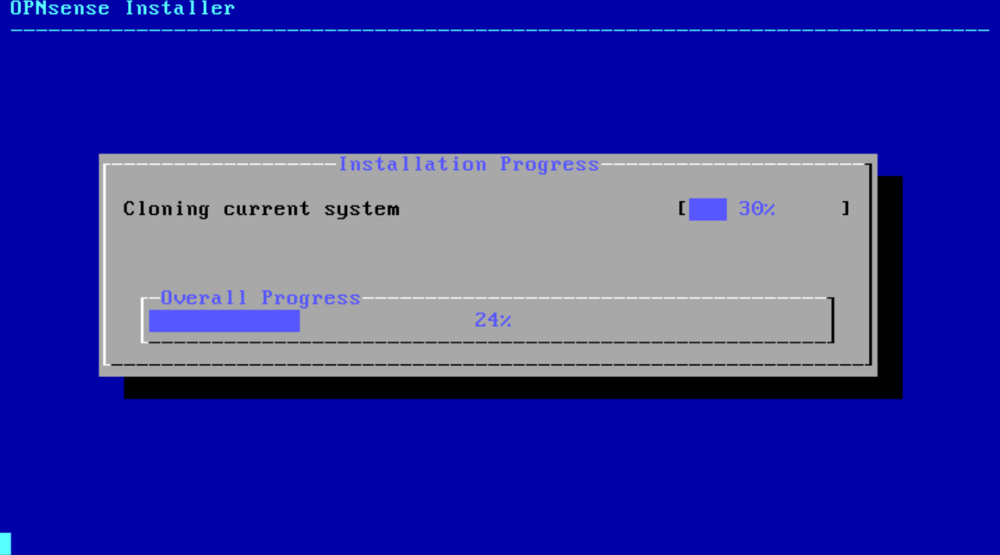
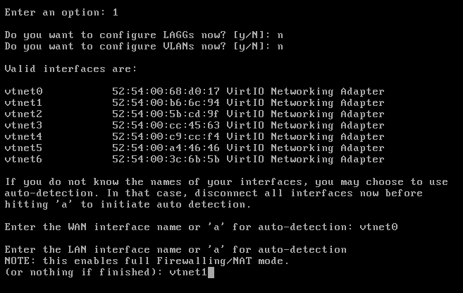
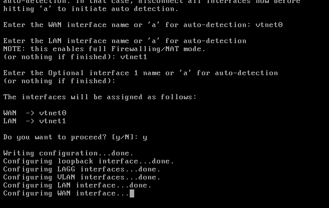
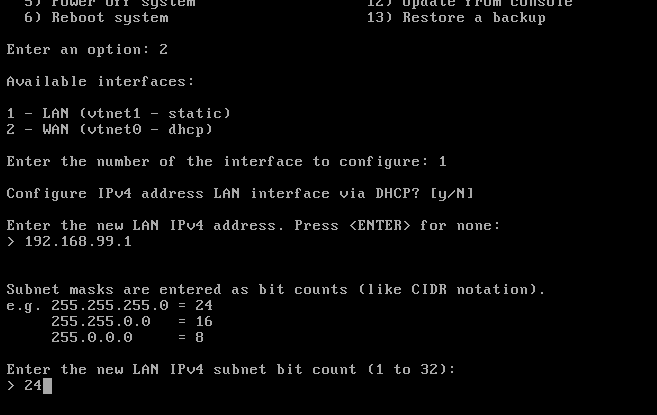
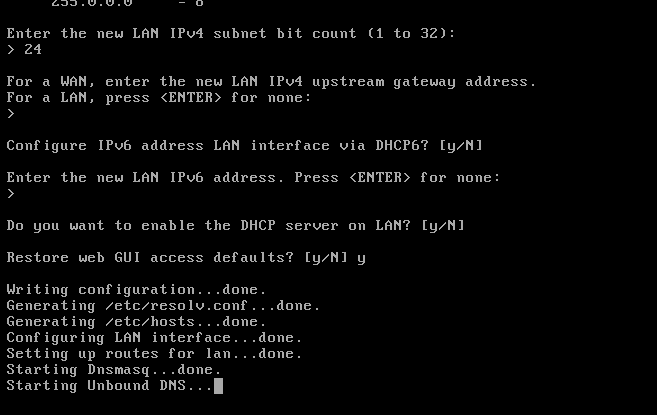

# Installing KVM and OPNsense

## Install KVM and Virtualization Tools

We need to install KVM (Kernel-based Virtual Machine) and its supporting tools to create and manage the OPNsense virtual machine and isolated network segments that form the backbone of our multi-interface VPN gateway architecture. KVM provides the hypervisor that will run our OPNsense VM, while libvirt acts as the management layer that handles VM lifecycle, virtual networking, and storage. The virt-manager package gives us a graphical interface for VM management and provides console access to VMs - meaning we can see and interact with the full desktop/interface of any VM (OPNsense shell interface, Linux desktop VMs, Windows VMs, etc.) as if we were sitting directly at that machine's console. These virtualization tools work alongside our NetworkManager-created bridges (br0 and br-mgmt) to provide the complete infrastructure needed for running OPNsense with multiple network interfaces, each connected to different isolated network segments for our various LAN networks that will route through different VPN endpoints or direct internet connections.

Run the next commands to install the required software, add your user to the `libvirt` group for permission to manage VMs, and configure your shell for a convenient, "sudo-less" workflow.

```bash
sudo apt update
sudo apt install qemu-kvm libvirt-daemon-system libvirt-clients bridge-utils virt-manager
sudo usermod -aG libvirt $USER
echo -e "\n# Set default KVM session to the system-level daemon\nexport LIBVIRT_DEFAULT_URI='qemu:///system'" >> ~/.bashrc
```

You must **reboot your system** now for the group membership and the new shell configuration to take full effect.

```bash
sudo reboot
```

After rebooting, your environment is ready. The changes we made allow you to manage all **system-level virtual machines** directly from your user account with tools like `virsh` or `virt-manager`, without ever needing to type `sudo`. Your VMs will be stored centrally in `/var/lib/libvirt/`, meaning they can be configured to start automatically with the host, giving you full power with maximum convenience.

## Creating Virsh networks

After installing KVM, we can define the virtual networks that our VMs will use. We are creating 5 networks:

- LAN10: connects to the internet directly through `br0`, without any VPN tunnel.
- LAN20: routes through a WireGuard VPN with port forwarding.
- LAN30: routes through a group of WireGuard VPNs, allowing dynamic switching of outgoing IP via OPNsense.
- LAN40: privileged network for development, CI/CD, and host service integration with full bidirectional trust.
- LAN50: fully isolated; no internet access, only internal communication between VMs in that segment.

We are creating these as simple, isolated `libvirt` virtual networks. OPNsense will later be configured to manage DHCP and routing for each of them. Execute the following commands to define and start the networks:

```bash
virsh net-define /dev/stdin <<EOF
<network>
  <name>switch-lan10</name>
  <bridge name='virbr-lan10' stp='off'/>
</network>
EOF

virsh net-define /dev/stdin <<EOF
<network>
  <name>switch-lan20</name>
  <bridge name='virbr-lan20' stp='off'/>
</network>
EOF

virsh net-define /dev/stdin <<EOF
<network>
  <name>switch-lan30</name>
  <bridge name='virbr-lan30' stp='off'/>
</network>
EOF

virsh net-define /dev/stdin <<EOF
<network>
  <name>switch-lan40</name>
  <bridge name='virbr-lan40' stp='off'/>
</network>
EOF

virsh net-define /dev/stdin <<EOF
<network>
  <name>switch-lan50</name>
  <bridge name='virbr-lan50' stp='off'/>
</network>
EOF

virsh net-start switch-lan10
virsh net-start switch-lan20
virsh net-start switch-lan30
virsh net-start switch-lan40
virsh net-start switch-lan50

virsh net-autostart switch-lan10
virsh net-autostart switch-lan20
virsh net-autostart switch-lan30
virsh net-autostart switch-lan40
virsh net-autostart switch-lan50
```

## OPNsense Installation

First we will download the iso image from [opnsense-download](https://opnsense.org/download/). Select `amd64` as system architecture and `dvd` and download the image.

In my case the file ends in `~/Downloads/OPNsense-25.7-dvd-amd64.iso.bz2`.

Now we can proceed with opnsense vm creation executing next instruction:

```bash
cd ~/Downloads
bunzip2 OPNsense-25.7-dvd-amd64.iso.bz2
sudo mv OPNsense-25.7-dvd-amd64.iso /var/lib/libvirt/images/
virt-install \
  --name "opnsense" \
  --ram "8192" \
  --vcpus "2" \
  --os-variant "freebsd13.1" \
  --disk path="/var/lib/libvirt/images/opnsense.qcow2",size="20",format=qcow2,bus=virtio \
  --cdrom "/var/lib/libvirt/images/OPNsense-25.7-dvd-amd64.iso" \
  --network bridge=br0,model=virtio \
  --network bridge=br-mgmt,model=virtio \
  --network network=switch-lan10,model=virtio \
  --network network=switch-lan20,model=virtio \
  --network network=switch-lan30,model=virtio \
  --network network=switch-lan40,model=virtio \
  --network network=switch-lan50,model=virtio \
  --graphics vnc,listen=127.0.0.1 \
  --noautoconsole
```

This will start the OPNsense virtual machine. You can access the shell using Virtual Machine Manager application.

After some time, the machine will end booting and at the login prompt, use username `installer` and password `opnsense` to access the installation menu. Select your preferred keyboard layout when prompted - this ensures proper key mapping during the installation and subsequent system administration. Choose **UFS** as the filesystem type, which provides reliable performance and simplicity for virtualized environments without the complexity overhead of ZFS.



Confirm **vtbd0** as the target storage disk for the installation - this is the 20GB virtual disk we created for the OPNsense VM. The installation process will automatically partition and format the disk with the selected UFS filesystem and install the complete OPNsense system. The installation typically takes several minutes to complete as it copies the system files and configures the base installation.



At the completion of the installation, you have the option to change the root password, which is recommended for security purposes. After setting a new root password, select complete installation to finalize the process, confirm the installation completion, and exit the installer. The system will then reboot automatically and should boot from the newly installed OPNsense system on the virtual disk rather than the installer ISO.

## Initial OPNsense configuration

After the system reboots, log in as `root` using the password you set during installation. The initial interface assignments will not match our network architecture requirements, so we need to configure them properly to establish basic connectivity and avoid IP address conflicts with the existing router infrastructure.

Use option **1) Assign Interfaces** to correctly map the network interfaces to their intended roles. Configure vtnet0 as the WAN interface, which connects to br0 and provides internet access through the existing router infrastructure. Set vtnet1 as the LAN interface, which will serve as our management network connected to br-mgmt. Leave the optional interfaces blank for now - the additional LAN interfaces (vtnet2, vtnet3, vtnet4, vtnet5) will be configured later through the web interface once basic connectivity is established.

My next figures show the questions I received and my responses in the console of opnsense:




After assigning interfaces, the WAN interface should automatically receive an IP address from the router's DHCP server, while the LAN interface may default to an IP that conflicts with the router's address space. Use option **2) Set interface IP address** set the address of LAN interface to **192.168.99.1/24**. Answer no when asked to enable the DHCP server, as it's not needed for this management network. The only other important choice to make is to revert the web GUI to HTTP for easier initial access.

Again if I was not clear explaining you have the images:




Now you can test that both wan and lan work on opnsense, executing next instructions in opnsense:

```bash
ping 192.168.99.1
ping 192.168.99.15
ping 8.8.8.8
```

And from the host you can access to web interface via `http://192.168.99.1`.
